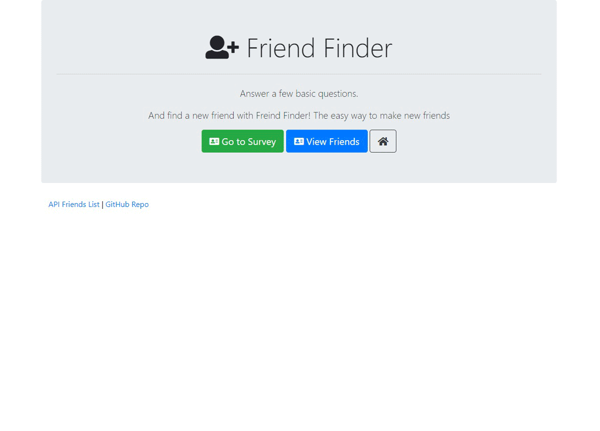

# FriendFinder

### Overview

This is an express app it works as a compatibility-based "FriendFinder" application -- basically a simple version of a dating app.

## Use Instructions

1. To run this app on your local machine, you'll need to install the following Node packages.

   * [body-parser](https://www.npmjs.com/package/body-parser) run _npm install body-parser_ 
   
   * [express](https://www.npmjs.com/package/express) run _npm install express_ 
   
   * [path](https://www.npmjs.com/package/path) run _npm install path_ 

## Configure your App 

1. Once your npm packages are installed you can start using the app.

2. Start the server by running the command " _node server.js_ "

3. Then navigate to [http://localhost:3000/](http://localhost:3000/) in your web browser 

4. Click on the survey button and fil in the survey.

  ## Running App

